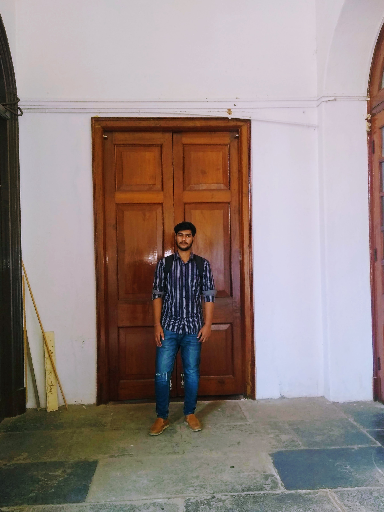

# Ananthakrishnan Nair RS 


```
I am pursuing BE in Computer Science  at SVCE Bangalore. 
```

## Skills

1. Programming Languages
  * C
  * C++
  * Java
  * Python
  * linux commands

2. Tools and softwares:

  * NetBeans
  * Eclipse EE
  * Git
  * Oracle Virtual Box
3. Web Development Technologies 
  * HTML
  * CSS
  * JS
  * BOOTSTRAP
  * Django
  * Flask  
## Find me on:

[GitHub](https://www.github.com/akrish4)

[LinkedIn](https://www.linkedin.com/in/Ananthakrishnan-Nair-RS/)

