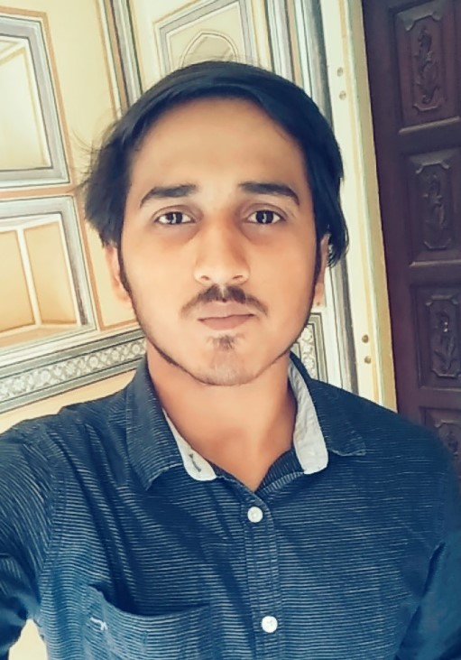

# Darsh Asawa


```
I am pursuing B.Tech in Computer Science with specialization in DevOps at UPES, Dehradun.
```

## Skills

1. Programming Languages
  * C
  * C++
  * Java
  * Python
  * Shell Scripting
2. Android Application Development:
  * JAVA
  * XML
  * SQLite
  * Firebase
3. Tools and softwares:
  * Apache Maven
  * Sonatype Nexus
  * NetBeans
  * Eclipse EE
  * Git
  * Jenkins
  * Oracle Virtual Box
  * VMware workstation pro
  * Oracle 11g and MySql
  
## Find me on:

[GitHub](https://www.github.com/DarshAsawa)

[LinkedIn](https://www.linkedin.com/in/darsh-asawa-846a8b178/)

