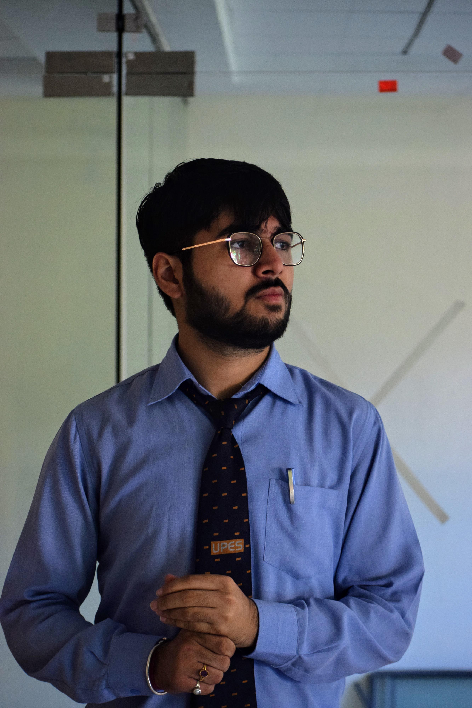

# Prajjawal Banati



```
I am pursuing B.Tech in Computer Science with specialization in DevOps at UPES, Dehradun.
```

## Skills

1. Programming Languages
  * C
  * C++
  * Java
  * Java Swing
  * Java Database Connectivity(JDBC)
  * Python
  * Shell Scripting
  * Android
2. Web Development:
  * HTML
  * CSS
3. Tools and softwares:
  * Netbeans
  * Android Studio
  * Apache Maven
  * Sonatype Nexus
  * Git
  * Jenkins
  * Xampp Server

## Work Experience:

1. Project Development Team Lead at OPEN Community in collaboration with Linux Foundation. - Jun '19 - Present.
2. Editorial Member in OPEN community.

## Find me on:

[GitHub](https://www.github.com/PrajjawalBanati)

[LinkedIn](https://www.linkedin.com/in/prajjawal-banati-b3a551160/)

[Twitter](https://twitter.com/PrajjawalBanati)

